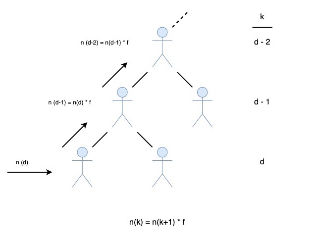
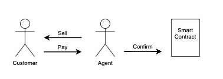
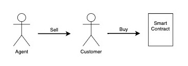

# Blockchain developer bootcamp final project | ConsenSys
Hierarchical reward system

An automated reward system for hierarchically organised groups of agents

1. Admin initializes a contract passing in the hierarchy and the set of products agnets will be selling
2. The agent sells a product and registers it in the contract
3. The Supervisor (root agent) confirms the sale
4. The reward system is triggered, dishing out rewards to the agent and all their superiors

The Flow of rewards

Interaction in centralized organizations

Interaction in decentralized organizations

